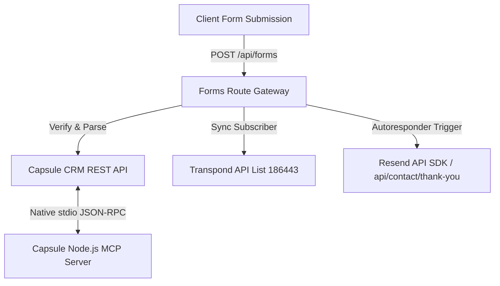

# 🌌 Power Digital Media — System Context & Source of Truth

> [!IMPORTANT]
> ### 🔔 MANDATORY DIRECTIVE FOR ALL DEVELOPER AGENTS
> **ALL FUTURE AI ASSISTANTS AND CONVERSATIONS MUST ADHERE TO THIS PROTOCOL:**
> 1. You **MUST** update this `context.md` file immediately upon completing any modification or milestone of importance (e.g., refactoring components, modifying CSS/Tailwind design systems, altering API/routing logic, updating CRM/Transpond sync engines, or resolving domain/account blocking bugs).
> 2. You **MUST** ensure that all sections (Technical Stack, System Architecture, Domain/SEO Alignments, Mobile UX framework, and Active Roadblocks) remain 100% accurate and mathematically/syntactically synced with the live codebase.
> 3. Never let this document fall out of date. It is the primary single source of truth for the Power Digital Media workspace.

---

## 🛠️ 1. Core Technical Stack
* **Framework:** Next.js 16.1.x (App Router) running on **Turbopack** and hosted on **Netlify**.
* **Styling & Motion:** Tailwind CSS (modern fluid grids, glassmorphism templates) + **GSAP (GreenSock)** for advanced scroll-driven viewport timelines and hardware-accelerated animations.
* **Database & Integrations:**
  * **Capsule CRM:** B2B lead organization & customer relationships.
  * **Transpond:** Marketing automation campaigns and autoresponders (Main List ID: `186443`).
  * **Resend SDK:** Backup serverless transactional emails (thank you and audit report autoresponders).
* **Booking Pipeline:** Google Calendar / Google Meet video funnel integrated at the `/book` route.
* **Telemetry & API Routing:** Next.js Serverless Route Handlers in `/api/forms` acting as a secure gateway bridge between client forms, Capsule REST models, and Transpond subscribers.

---

## 🔗 2. System Architecture & Integrations

### 🗄️ Database & Sync Pipelines
1. **Capsule CRM Node.js MCP Server:**
   - **Path:** `E:\AntiGravity\capsule-mcp-node\index.js`
   - **Protocol:** Stdio-based JSON-RPC 2.0. Eliminates Docker/WSL dependencies. Exposes **53 tools** matching the Zestia schema.
   - **Telemetry:** Automated file logging actively buffered in `capsule-mcp.log`.
2. **Capsule-to-Transpond Marketing Pipeline:**
   - **Path:** `E:\AntiGravity\capsule-mcp-node\sync-strategies.js`
   - **Status:** Tested and verified live. Seamlessly registers leads scheduling a Google Meet strategy session into your primary Transpond campaign with an immediate welcome email hook.

---

## 🌐 3. Critical SEO & Domain Alignments (Fixed)
* **Active Domain:** `powerdigitalmedia.org` (All 34 outdated `.com` database, content, sitemap, and LLM text references programmatically swept and standardized to prevent crawling indexing split).
* **Active Phone Line:** `+16014462393` (NAP verified. Fake placeholders replaced across all metadata layouts).
* **Local SEO Schema (`src/app/layout.tsx`):**
  * Synthesized machine-readable `LocalBusiness` JSON-LD schema.
  * Nested a perfect `5.0` `AggregateRating` based on `15` real testimonials.
  * Embedded structured reviews from **Google, Better Business Bureau (BBB), and Facebook** to capture off-page local search authority.
  * Configured expanded `sameAs` social and entity vectors.

---

## 📱 4. Mobile UX & Animation Optimizations (Fixed)
* **Interactive Glassmorphic Bento Grid Portfolio:** Replaced the heavy, scrolling-hijacked GSAP horizontal carousel with a premium, vertically-scrolling asymmetric Bento Grid. Features brand-matched glowing highlights, custom technology chips, and live metric badges (e.g. `98% PageSpeed`, `400+ Hours Saved`, `5.2x ROAS`) that visually validate our engineering authority.
* **Sleek Action Dock:** Integrated blurred semi-solid glassmorphic trays at the bottom of portfolio cards to mask underlying screenshot graphic text and prevent visual overlap glitches.
* **Fluid Spacing & Typography:** Replaced static margins and layouts with responsive, fluid variables across the Homepage Hero, Services, and Tech Stack pages. Text headings center natively to anchor mobile screens while lists revert to crisp, left-alignment to keep bullet points vertically linear.
* **Resend Resiliency:** Added module-level fallback strings (`|| 're_placeholder'`) to transactional route initializers. This prevents serverless routes from crashing when api keys are absent in local test environments.

---

## 🚨 5. Active Roadblocks & Immediate Actions

### 🔑 A. Google Identity & Workspace Resolution
* **The Glitch:** The business email `damein@powerdigitalmedia.org` was bound as a personal Google alias on the primary Gmail address `dameindonald.cor@gmail.com`. This triggered a conflicting account flag, locking profile subscriptions and triggering a red security warning shield.
* **The Resolution Steps:**
  1. The user successfully updated their Google password to a secure Diceware passphrase (`Cyber-Portal-[Custom]-###`).
  2. **Action Required:** The user must open their Google Account dashboard, click **"Review & secure"** under recovery settings to clear the warning shield.
  3. **Action Required:** Keep the accounts strictly separate by creating **two distinct Chrome Browser Profiles**—one for personal tasks (`gmail.com`) and one for business (`powerdigitalmedia.org`)—to prevent cookie collisions.

### 📍 B. Google Business Profile (GBP) Verification
* **The Glitch:** Automated maps verification loops are blocked due to the virtual office coordinates and the active identity conflict flag.
* **Action Required:** Submit a manual verification ticket to the Google Business Profile help desk attaching the official Mississippi LLC registration documents, a utility bill, and local Jackson NAP proof.

### 📣 C. B2B Client Acquisition Pipeline Refinement
* **The Glitch:** Casual traffic campaigns running on Meta ($5–$10/day targeting MS business owners) are yielding minimal traffic and zero engagement due to high landing-page exit friction on mobile devices and tech-jargon intimidation.
* **The Solutions (Detailed in the [Acquisition Blueprint](file:///C:/Users/User/.gemini/antigravity/brain/b82f149b-23c4-4b75-8086-31e312a8d2e3/local_acquisition_blueprint.md)):**
  1. **Play 1 ("The Snatch"):** Initiate value-first organic outreach. Record 3-minute personalized Loom screencasts showing local business sites breaking, and send them directly to local owners.
  2. **Play 2 (In-App Lead Forms):** Switch paid Meta campaigns from traffic redirects to **Native Lead Generation (Instant Forms)** to drop mobile friction by 90% and capture leads inside Facebook/Instagram with auto-filled fields.
  3. **Play 3 (GBP Domination):** Drive high-intent search traffic by ranking in the local Google Map Pack once manual verification is cleared, capturing 5-star reviews from active clients (Tbeaux Seafood, Powered by Peptides).

---

## 🏁 6. Active Milestones & Current Progress Status

The project is currently in a **100% stable, fully compiled, and production-ready state**. The latest updates resolved:
* **SOTA Interactive Glassmorphic Bento Grid Portfolio (`src/components/sections/Portfolio.tsx`):**
  - Completely replaced the heavy, scroll-hijacking GSAP horizontal sliding/pinning carousel with a beautiful, natural-scrolling asymmetric Bento Grid on the Home, Web Design, Production, and Marketing pages.
  - Configured custom geometric card spans on desktop (e.g. `col-span-8` landscape + `col-span-4` portrait) and clean vertical stacks on mobile.
  - Implemented brand-matched dynamic hover border glows and radial highlights utilizing React state and native CSS.
  - Embedded high-contrast B2B performance indicators and live-metric badges (`98% PageSpeed`, `400+ Hours Saved`, `5.2x ROAS`) to visually validate engineering and marketing authority.
  - Enabled smooth cinematic mouse-hover zoom parallax on screenshot mockups.
* **Overhauled Paid Social & Marketing Services Page (`src/app/marketing/page.tsx`):**
  - **Bento Grid Integration:** Dynamically imported and rendered our new `<Portfolio />` Bento Grid component to display client case studies, replacing the horizontal sliding carousel and previous static 3-column placeholder.
  - **Strategic Partner Pivot:** Redesigned the page to highlight the **certified Capsule CRM & Transpond partnership**, positioning this pipeline as the exclusive high-performance operational engine for local business deployments.
  - **Pillars Refined:** Replaced generic cards with three certified operational pillars: **B2B Growth Funnels (Transpond + Next.js), Behavioral Email Marketing (Transpond sequences), and Sales Opportunities Management (Capsule visual pipelines)**.
  - **Growth Tiers Updated:** Realigned all pricing packages to detail specific sync setups, Capsule contact integrations, email welcome automation, and CRM Sales Pipeline Opportunity board configurations.
  - **Homepage Visual Matching:** Standardized the hero section to match the spacious centered design, typography, double button styles, and NAP PageSpeed-style trust bar layout of the homepage.
  - **Telemetry Dashboard Showcase:** Moved the custom 3D isometric marketing telemetry graphic (`marketing_telemetry_system.png`) inside a floating glassmorphic dashboard mockup frame adjacent to the lead sync pipeline phases.

* Codebase-wide `.com` domain alignment to standard `.org`.
* Safe fallback triggers for Resend email initializations to prevent route crashes.
* Upgrade of all service landing hero secondary CTA buttons to point to the direct Google Meet booking path `/book` with premium pulsing videography elements.
* Rich JSON-LD review structures nested in the site layout to establish trust graph matching against Google and BBB.
* Creation of the local B2B acquisition playbook.

All developments have been verified using type-safe compilation checks (`npx tsc --noEmit` is clean) and successfully committed.

